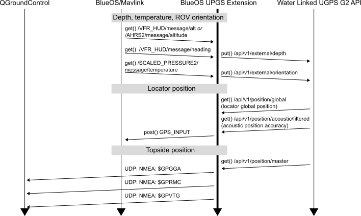

# BlueOS Extension for Water Linked Underwater GPS

## State

This BlueOS-extension **has no UI page** (so it creates no listing in the sidebar of BlueOS).

Documentation of the hardware and standard use can be found at https://waterlinked.github.io/underwater-gps/integration/bluerov-integration/ . This README is intended for advanced users.

## Functionality

Assuming the UGPS is detected and working, this service
* forwards MAVLink data from [Mavlink2Rest](https://github.com/patrickelectric/mavlink2rest) like depth to the UGPS Topside (to enable it to function)
* forwards locator position from UGPS Topside to MAVLink (message `GPS_INPUT`)
    * the autopilot should send corresponding `GPS_RAW_INT` messages to the topside computer (QGroundControl)
    * the autopilot sends regular `GLOBAL_POSITION_INT` messages to the topside computer with its filtered position estimates
* forwards topside position from UGPS Topside to UDP port `14401` with NMEA to be received by QGroundControl.
    * This feature is **experimental** and does not work reliably with all versions of QGroundControl.

Information flow triggered by this extension:



If you do not have access to a UGPS system, you can use UGPS_HOST=https://demo.waterlinked.com , which simulates a UGPS system with its API.

## How to install

There are 2 options

### Preferred: Use the extensions manager in BlueOS > 1.1.0
* Click Extensions > Extensions Manager
* Install this extension

Configuration of the extension is not required for standard usecases.

You can change the behaviour of this extension by editing the command-line parameters with which it is started:

* Editing requires [Pirate Mode](https://docs.bluerobotics.com/ardusub-zola/software/onboard/BlueOS-latest/advanced-usage/#pirate-mode)
to be enabled. Turn that on.
* Open the "Installed" tab of the Extensions Manager.
* In Pirate Mode an "Edit"-button becomes available below the UGPS extension.
* Copy the Original Settings contents into the Custom settings box, and (if necessary) change the IPs/Host addresses or additional args (EXTRA_ARGS=)

Example to use our demo server - if you do not have a UGPS system and still want to test the extension:
```
{
  "NetworkMode": "host",
  "Env": [
  "UGPS_HOST=https://demo.waterlinked.com",
  "MAVLINK_HOST=http://192.168.2.2:6040",
  "QGC_IP=192.168.2.1",
  "EXTRA_ARGS="
  ]
}
```

* Use the "View Logs" button to check the status of the extension and debug connection issues.

### For developers: Build docker image yourself and start it

To set this up, ssh into the Raspberry Pi (or access via `red-pill` in [BlueOS Terminal](https://docs.bluerobotics.com/ardusub-zola/software/onboard/BlueOS-1.0/advanced-usage/#terminal))

install git, clone this repository and run
```
# build the docker image
docker build -t waterlinked/blueos-ugps-extension:latest .
# see all images
docker images

# running the plugin

# either: run detached
#   with standard command
docker run -d --net=host waterlinked/blueos-ugps-extension:latest python app/main.py --ugps_host http://192.168.2.94 --mavlink_host http://192.168.2.2:6040 --qgc_ip 192.168.2.1
#   or with demo server
docker run -d --net=host waterlinked/blueos-ugps-extension:latest python app/main.py --ugps_host https://demo.waterlinked.com --mavlink_host http://192.168.2.2:6040 --qgc_ip 192.168.2.1

# or: in interactive shell to get debug output
docker run -it waterlinked/blueos-ugps-extension:latest /bin/bash
#   with standard command
cd app && python main.py --ugps_host http://192.168.2.94 --mavlink_host http://192.168.2.2:6040 --qgc_ip 192.168.2.1
#   or with demo server
cd app && python main.py --ugps_host https://demo.waterlinked.com --mavlink_host http://192.168.2.2:6040 --qgc_ip 192.168.2.1
# end interactive session
exit

# then stop/start/look at log with
docker stop [container-id]
docker start [container-id]
docker log [container-id] # if run detached

# if you are a developer, upload the docker image to registry with (replace "latest" with desired tag)
docker login -u waterlinked docker.io
docker push waterlinked/blueos-ugps-extension:latest
```
